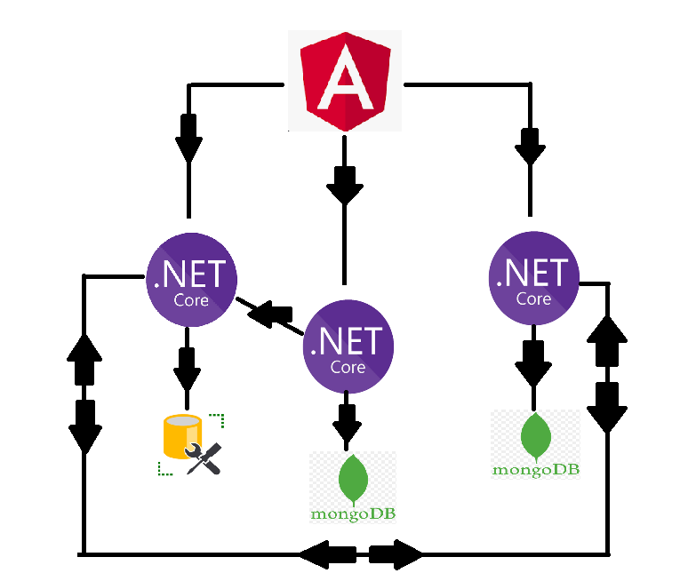

This project is a simple chat application made by using these tools:

- Angular for forntend
- Asp.net core min API for backend
- Mongo Db and Ms SQL Server as databases

Backend has 3 microservices, each of them has their own database (2 of them are mongo dbs and one sql server)

Originally I wanted to use Entity Framework to interact with Mongo Databases but I found that the official MongoDb Driver is much better,
thus Entity framework is only used to generate databases if they do not exist (I might remove this in the future and check if the mongo db driver has this functionality.)

The application is not yet finish though it's already functional. Users can chat in real time thanks to singal r, they can block each other and add to their friends lists.
I am still writing tests and they are some improvements I'd like to make.

